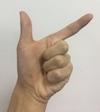
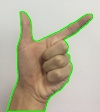
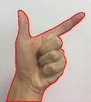
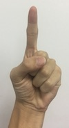
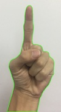
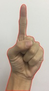
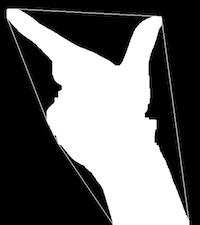

# gesture-recognition
install cmake, opencv2, run as below insturctions:
```shell
cmake .
make
./main
```

#### step 1: find the hand
<table align="center">
    <tr>
        <td align="center">origin</td>
        <td align="center">py version</td>
        <td align="center">C++ version</td>
    </tr> 
    <tr>
        <td align="center"></td>
        <td align="center"></td>
        <td align="center"></td>
    </tr>
    <tr>
        <td align="center"></td>
        <td align="center"></td>
        <td align="center"></td>
    </tr>
</table>
#### step 2: compared with template gestures by similarity
#### step 3: find the finger point by max convex
<div align="center">
    
</div>

