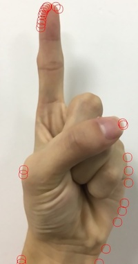
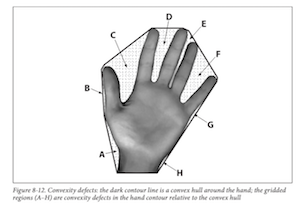
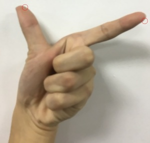

# gesture-recognition
install cmake, opencv2, run as below insturctions:
```shell
cmake .
make
./main
```

#### how to use
```C++
Gesture gesture(im);
// 存在手返回true, 否则false
gesture.HasHand();
// 返回的vector的大小为空，则没有手势匹配；1，匹配一字；2，匹配八字；
gesture.getFingerLocation(std::vector<cv::Point>)
```
#### step 1: find the hand
<table align="center">
    <tr>
        <td align="center">origin</td>
        <td align="center">py version</td>
        <td align="center">C++ version</td>
    </tr> 
    <tr>
        <td align="center"></td>
        <td align="center"></td>
        <td align="center"></td>
    </tr>
    <tr>
        <td align="center"></td>
        <td align="center"></td>
        <td align="center"></td>
    </tr>
</table>

#### step 2: compared with template gestures by similarity
#### step 3: find the finger point by max convex
max convex:
<div align="center">
    
</div>

contours of max convex:
<div align="center">
    
</div>

#### step 4: calculate convexity defects

<div align="center">
    
</div>

#### step 5: keep the contours which depth > threshold, find the finger point
<div align="center">
    
</div>


#### install cuda
#### install opencv with gpu support
```shell
sudo apt-get -y update
sudo apt-get -y upgrade
sudo apt-get -y dist-upgrade
sudo apt-get -y autoremove
# Build tools:
sudo apt-get install -y build-essential cmake make
sudo apt-get install -y libvtk6-dev qt5-default 
# Media I/O:
sudo apt-get install -y zlib1g-dev libjpeg-dev libwebp-dev libpng-dev libtiff5-dev libjasper-dev libopenexr-dev libgdal-dev
# Video I/O:
sudo apt-get install -y libdc1394-22-dev libavcodec-dev libavformat-dev libswscale-dev libtheora-dev libvorbis-dev libxvidcore-dev libx264-dev yasm libopencore-amrnb-dev libopencore-amrwb-dev libv4l-dev libxine2-dev
# Parallelism and linear algebra libraries:
sudo apt-get install -y libtbb-dev libeigen3-dev
# Documentation:
sudo apt-get install -y doxygen
sudo apt-get install -y unzip wget
```
download from [opencv 2.4.13.4](https://opencv.org/releases.html)
```shell
mv ~/Downloads/opencv-2.4.13.4.zip ~
unzip opencv-2.4.13.4.zip && mv opencv-2.4.13.4 opencv
cd opencv && mkdir build && cd build
cmake \
    -D CMAKE_BUILD_TYPE=DEBUG \
    -D CMAKE_INSTALL_PREFIX=/usr/local \
    -D WITH_CUDA=ON \
    -D WITH_CUBLAS=ON \
    -D CUDA_FAST_MATH=ON \
    -D WITH_CUFFT=ON \
    -D WITH_NVCUVID=ON \
    -D WITH_V4L=ON \
    -D WITH_LIBV4L=ON \
    -D WITH_OPENGL=ON \
    -D WITH_FFMPEG=ON \
    -D INSTALL_C_EXAMPLES=ON \
    -D BUILD_EXAMPLES=ON \
    ..
make -j16 && sudo make install && sudo ldconfig
```

after all if you want to use opencv with gpu support:
```shell
mkdir build
cmake -DCUDA_USE_STATIC_CUDA_RUNTIME=OFF ..
make
./main
```
